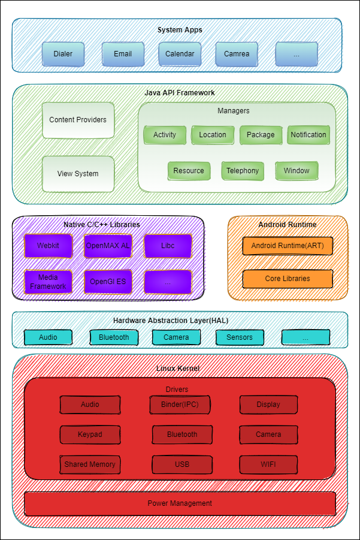

Android is a portable and movable terminal system,is a open source software protocol stack based on linux2.6.
Android system architecture contains the following components:


#### Application Framework
#### Binder IPC
#### System Services(Native C/C++ Libraries and Android Runtime)
#### Hardware Abstractub Layer
#### Linux Kernel


Android系统开机后，通过解析init.rc文件会启动init进程（init进程是伴随着linux系统开机到关机的一个守护进程），然后启动Zygote进程和SurfaceFlinger（启动开机动画bootanimation）等，Zygote启动SystemServer，启动AMS，WMS，PMS等，启动Launcher然后请求SurfaceFlinger退出开机动画。进入Android。


硬件抽象层 HAL （Android Hardware Abstraction Layer） 
HAL的实现需要通过JNI  
```
.so  
app->app_manager->service(java)->service(jni)->HAL
```


屏幕适配  
1、最小宽度匹配  
2、今日头条屏幕适配  

占位Loading加载库--骨架层  


#### 重要概念

Ashmem（Anonymous Shared Memory）匿名共享内存子系统

parsePackage 归档APK文件（通过PackageParse.java）


#### WindowManagerServer

根据屏幕及装饰区的大学校来决定Acitivity的窗口大小。

#### PackageManagerService

apk是一个zip压缩包，文件头记录压缩包的大小，在文件尾追加资源不影响解压。

下载安装app时，会把app放到data/app目录下，通过解析resource.arsc文件，寻找相应的资源文件。

resource.arsc存储着所有的资源文件。

#### ActivityManagerService

四大组件启动后以及后续不断与AMS通信，AMS会使用PMS加载包的信息，将其封装在LoadedApk这个类对象中，从中可以取出在AndroidManifest中声明的四大组件信息。


一个应用中包含的Context个数=Service个数+Activity个数+1（Appplication类本身对应一个Context对象）


#### AIDL几个重要的类 

* IBinnder
* IInterface
* Binder
* Proxy
* Stub


Context几种模式

* MODE_PRIVATE
* MODE_READABLE
* MODE_WRITEABLE
* MODE_APPEND
* MODE_MULTI_PROCESS


#### Libraries概览

1、Surface Manager

​	当系统同时执行多个应用程序时，Surface Manager会负责管理显示与存取操作间的互动，另外也负责将2D绘图与3D绘图进行显示上的合成。

2、Media Frameword

​	多媒体库，基于PacketView OpenCore，编码格式有MPEG4、MP3、H.264、AAC、ARM

3、SQLite

​	轻量级关系型数据库

4、OpenGL|ES

​	3D绘图函数库

5、FreeType

​	点阵字与向量字的小描绘与显示

6、Webkit

​	网页浏览器引擎

7、SGL

​	底层的2D图形渲染引擎

8、SSL

​	Android通信实现握手

9、Libc

​	从BSD继承来的标准C系统函数库，专门为基于嵌入式linux的设备定制


#### SDK目录结构

-add-ons

附加库，如谷歌地图

-build-tools

不同版本的编译工具

-docs

Android SDK开发文件和API文档

-emulator

模拟器文件

-extras

扩展开发工具包

-platforms

不同版本的Android系统

-platform--tools

版本SDK通用工具。比如adb和aapt、aidl、dx等文件，和tools会有重复，会影响到xml布局文件的构建。

-sources

不同版本的Android源码

-system-images

模拟器映像图片

-tools

各版本SDK自带工具，mksdcard则是模拟器SD映像的创建工具，emulator是androidSDK模拟器主程序。


#### AndroidStudio目录结构（project视图）

-.gradle

gradle编译系统，版本由wrapper指定

-.idea

系统自动生成的关于AS的环境配置目录。包括版权、字典、jar包信息、项目名称、编译信息等。

-build

系统自动生成项目工程的编译目录

-gradle

--wrapper

---gradle-wrapper.jar

---gradle-wrapper.pproperties

gradle wrapper是对gradle的一个包装

-app

名为app的一个项目模块

-.gitignore

git的同步忽略文件

-build.gradle

项目工程的 Gradle编译配置文件

-gradle.properties

gradle相关的全局属性设置

-gradlew

linux下gradle wrapper可执行文件

-gradlew.bat

windows下gradle wrapper可执行文件

-local.properties

本地属性文件

-README.md

自己项目的说明文件

-settings.gradle

gradle配置文件


#### 相关屏幕知识

屏幕尺寸：屏幕的对角线长度，单位是英寸。1英寸等于2.54厘米

屏幕分辨率：在横竖方向的像素点数，单位是px。1px是1像素

屏幕像素密度：每英寸上的像素点数，单位是dpi

> 1dpi=屏幕对角线上的像素点数/屏幕尺寸

dpi、dp、dip、sp、px

px即像素（使用android原生api返回都是px）

sp文字大小，推荐使用12,14,18,22

dp，dip是像素无关密度

> 以160dpi为标准，1dp=1px


mdpi、hdpi、xdpi、xxdpi


名称 |像素密度范围/dpi

--- | ---

mdppi | 120~160

hdpi | 160~240

xdpi | 240~320

xxdpi | 320~480

xxxdpi |480~640


#### 相关存储信息

SharedPrefence（存储路径：/data/data/Package Name/Shared_Pref）

File(存储路径：/data/data/Package Name/files/)

SQLite（存储路径：/data/data/PackageName/database/）

ContentProvider

网络


#### Android 窗口对象

1、Application Window

2、Sub Window

3、System Window

> 有两个实现类：PhoneWindow、MidWindow